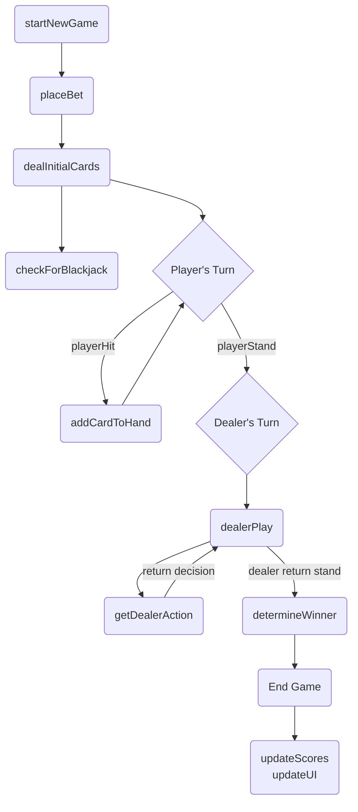

# State Flow Diagram

# Requires External APIs and Components
- Deck Logic Team needs to provide API (`card-deck.js`): 
     - `deck.reset()`
     - `deck.shuffle()`
     - `deck.drawCard()`
     - `deck.drawCards()`
     - `deck.discardCard()`
     - `deck.cards`
     - `deck.discardPile`
     - `deck.getState()`
     - `deck.setState()`
- Card UI Team needs to provide `<playing-card>` component
- Dealer Logic Team needs to modify `getDealerAction()`
